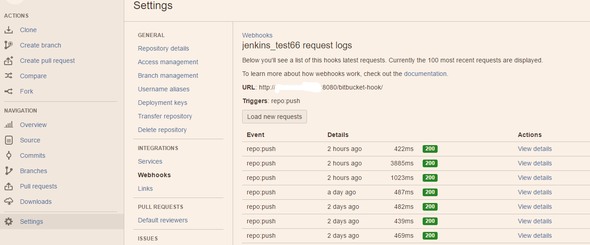

push到Bitbucket通知Jenkins
=========================== 

bitbucket 網站設定
----------------

#### 1．bitbucket網站上設定hook：
* 先找到目标项目的配置页面，然后在配置下看到 Webhooks，选择 “Add Webhooks"。
URL 的格式是 `http://YOUR_JENKINS_URL:8080/bitbucket-hook/` (最后的这个斜杠不能省掉)。如此保存就可以了。

* 成功可試著push程式碼到bitbucket上，在bitbucket上在剛剛的webhook裡可以看傳送到YOUR_JENKINS_URL的歷史記錄，actions→view requests

  以及在jenkins的`系統記錄`也可以看bigbucket推送過來的request

   
   
jenkins 設定
----------------
#### 2．jenkins安裝外掛：`Bitbucket Plugin`

#### 3．設定git repository 來源
job中`原始碼管理 > git > Repositories url` 要設定要對應到bitbucket上哪一個的repository `https://bitbucket.org/USERNAME/PROJ.git`
，如果是私有repository要設定credentials

#### 4．設定觸發條件
* job中`建置觸發程序`> `Build when a change is pushed to BitBucket`打勾，之後jenkins收到bitbucket傳來的request會觸發有打勾的所有job並且job設定的repository url是監聽的url

> [下一頁：jenkins設定](jenkinssetup.md)

